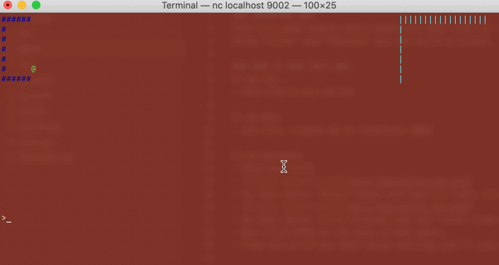

### OVERVIEW ###
This is a game engine which generates ANSI code for a TCP connection over a terminal.
Using "Tiles" and "Regions" you can build a screen.

### HOW TO RUN THIS ###
1) go run .
- This starts our server

2) On Mac:
- run stty -icanon && nc localhost 9002

3) On Windows:
- Download PuTTy
- 
- As seen above: Insert these settings (in red); click SAVE
- 
- As seen above: Click Terminal and set "Local line editing" and to "Force Off". Save again.
- Now click OPEN on the main screen again. 
- From now on if you SAVE these settings you'll just have to "Load" than "Open" in the future

### MAIN DEMO ###
- v0.01 Initial Commit
- 

### MAIN STRUCTS ###
- Screen
Think old computers with all their talk of "column count" and you have a good idea on how this will work.
A screen is a collection of TILES and a string which represents what is sent to the users terminal
We the programmer push "tiles" to represent characters we want to display in a column/line and than compile it into the "RAW" string which is the ANSI code needed to be sent to the user terminal
- Tile
A tile is a representationo of a single Column/Line cooordinate.
#Icon# represents the actual "character" you'll see.
#Color# stores the ANSI code to change the characters color (just foreground for now)
Why?
Because its hard to calculate WHERE on our screen a character will appear when just directly using strings. ANSI codes are just ugly strings which become invisible when submitted to the clientt terminal.
This makes it easier for you; the programmer.
- iRegion
We'll want different sections of the screen; and an easy way to determine what to draw.
Regions are just screen sections.
Thus far I have:
level (aka map)
profile (aka user info area)

### What is DONE ###
1) Can draw to screen
 - with color!
 - icons are in solo file
2) Can do input
- nice
3) detect wall collision
4) detect enemy collision

### TODO ###
1) Can I find new line that works on both mac and windows?
--- windows wants \r\n ; mac was cool with \n
2) Build a session struct to contain player, map, and connection object.
3) Make input it's own class thingy
4) Read from file maps
5) Do some actual enemy stuff
--- can remove it now
--- want drops
--- want spawns
6) Intro screen and map selection
7) Make better file naming,