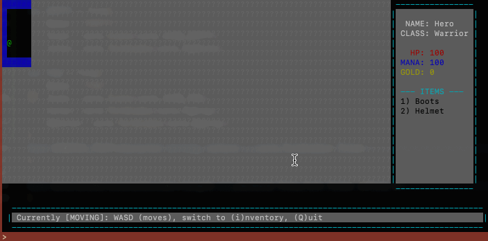

### OVERVIEW ###
This is a game engine which generates ANSI code for a TCP connection over a terminal.
Using "Cells" "Tiles" and "Regions" you can build a screen.

### HOW TO RUN THIS ###
1) go run .
- This starts our server

2) On Mac:
- run stty -icanon && nc localhost 9002

3) On Windows:
- Download PuTTy
- 
- As seen above: Insert these settings (in red); click SAVE
- 
- As seen above: Click Terminal and set "Local line editing" and to "Force Off". Save again.
- Now click OPEN on the main screen again. 
- From now on if you SAVE these settings you'll just have to "Load" than "Open" in the future

### MAIN DEMO ###
- v0.0.1 Initial Commit
- 

- v0.0.3 Better coloring, Now have most "in game" regions defined.
- 

- v0.0.4 We have COOOOMBAT now.

- v0.0.5 Fog exist! Health returned on fog.
-- Stats for players and enemies exist as well
-- examples of how to update screens now implemented
-- switched to CELLS which are just stacks of tiles
- 

- v0.0.6 Items-a-palooza
-- Items are now a thing to pickup and uses
-- this includes potions, equiptment AND spells
-- One spell implemented
-- ton of refactor work
- 

- v0.0.7 The Great Last Refactor
-- Refactored input and a ton of other code
-- Finally added file parsing for levels and items
-- Randomization of things on the Level!
-- New enemies generated
-- Removed a ton from our session object (as I should have)
-- added header region
-- Modfied other regions
-- added menus (just static text things)
- 

- v0.0.8 Great Refactor 2
-- This will be refactoring how we handle file parsing
-- There are things I put into core which seem stupid to do so in hindsight so ill be moving them
-- Pop ups are now useful!
-- Generate a static HTML file for level editing
-- Generate a static HTML file for splash screen editing
- 

- v0.0.9 Main menus and story
-- We will write out the story
-- A main menu for game selection will be implemented
-- Classes for the hero will now be a thing
-- signs in levels for pop ups will be a thing
-- Maybe gods will be added?

### MAIN STRUCTS ###
- Screen
Think old computers with all their talk of "column count" and you have a good idea on how this will work.
A screen is a collection of CELLS and a string which represents what is sent to the users terminal
- Cells
An array of "TILES". These help determine Zindex on the screen.
We the programmer push "tiles" to represent characters we want to display in a column/line and than compile it into the "RAW" string which is the ANSI code needed to be sent to the user terminal
- Tile
A tile is a representationo of a single Column/Line cooordinate.
#Icon# represents the actual "character" you'll see.
#Color# stores the ANSI code to change the characters color (just foreground for now)
Why?
Because its hard to calculate WHERE on our screen a character will appear when just directly using strings. ANSI codes are just ugly strings which become invisible when submitted to the clientt terminal.
This makes it easier for you; the programmer.
- iRegion
We'll want different sections of the screen; and an easy way to determine what to draw.
Regions are just screen sections.
Thus far I have:
level (aka map)
profile (aka user info area)

### TODO ###
1) Signpost which trigger popups.
2) Enemy Drops
3) map selection / main menu
4) Add FOG wall detection (cannot see through walls)
5) Start thinking about town hub interactions.
7) Multi-layered levels? Multi BOSS levels?
8) End conditions for beating the level
9) Gods or deities for interesting gameplay
10) Finish story
11) Finish how to play
12) Test with multiple connections
13) Save state
14) Try finding a way to host this
15) Allow characters to have diff. item limits (advantage for detective maybe?)
16) CLEAN UP STATES! -- it's a mess!

### BUGS ###
- title on level doesn't load, just says "SOME TITLE"
- The "direction" cue for which enemies are nearby changes to your intended spot when you "attack" giving misinformation.
- Enemy level generation is not so solididly ....distributed? may be because im less than 10 enemies.